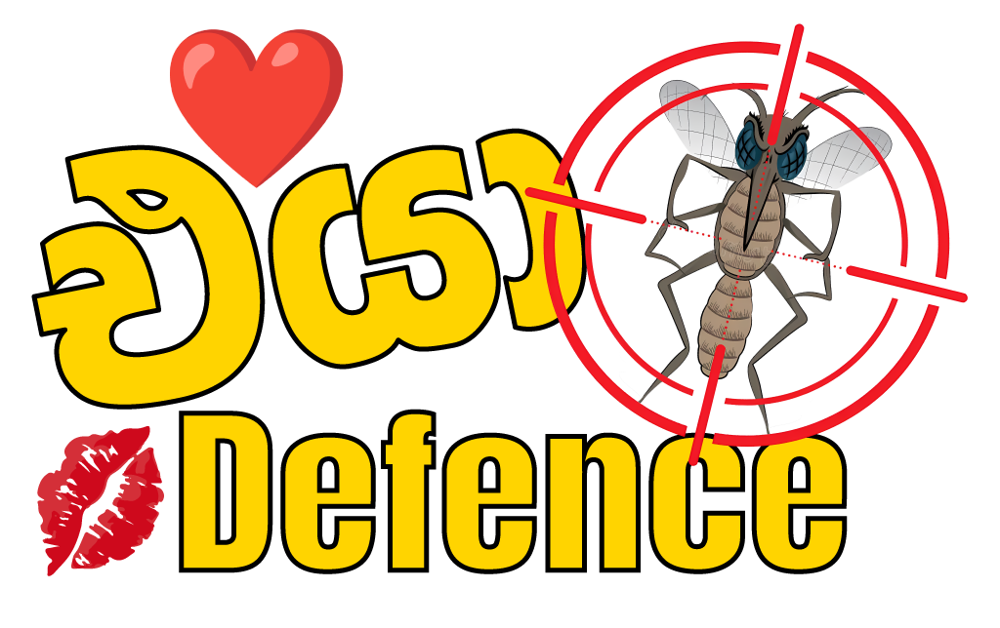
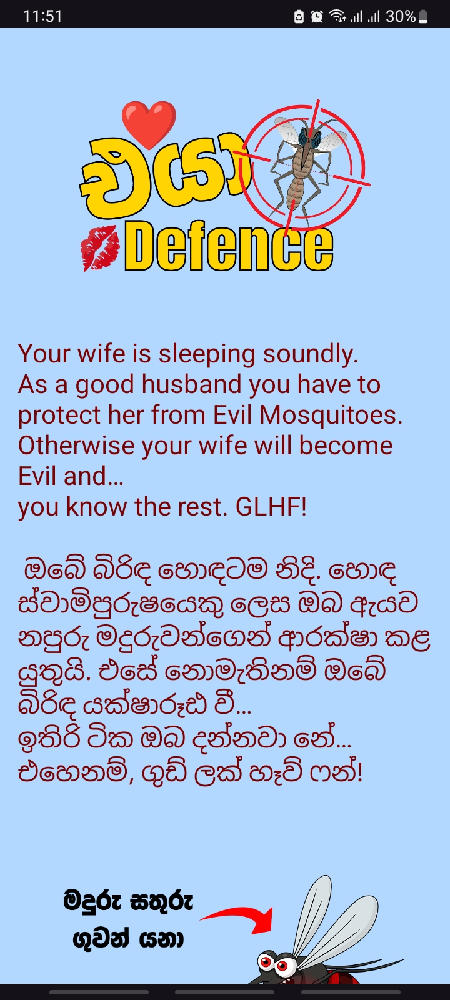
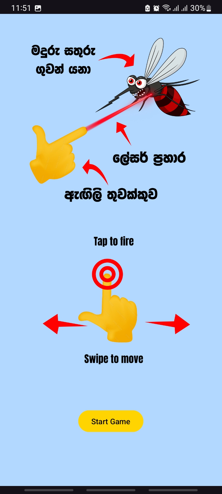
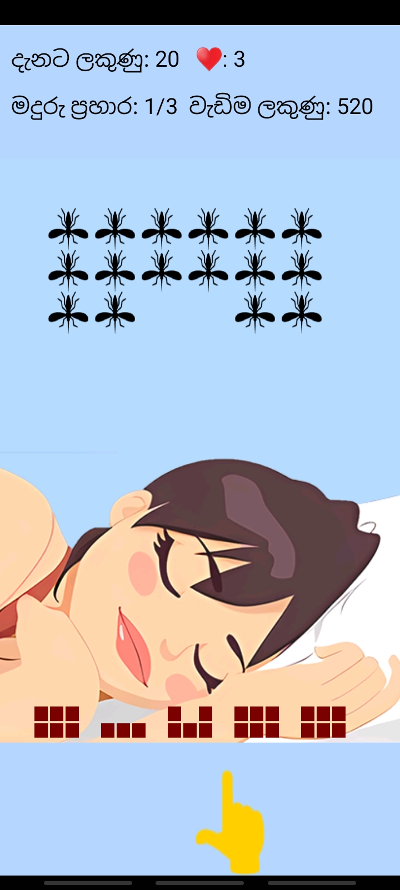

# Eya Defence

  

## Description
**Eya Defence** is a casual strategy and tactics game where you play as a loving and caring husband defending your sleeping wife from evil mosquitoes. With increasing waves of mosquitoes, your goal is to protect her at all costs, ensuring she doesn't wake up angry.

## Features
- **Title:** Eya Defence
- **Genre:** Strategy, Tactics, Casual
- **Mode:** Single Player
- **Platform:** Offline, Android, Mobile
- **Objective:** Defend the wife from evil mosquitoes while she sleeps.
- **Player Character:** A loving and caring husband.

## Gameplay Mechanics
- Three waves of mosquitoes, each wave consisting of 15 mosquitoes.
- Shoot lasers at mosquitoes by pointing your fingers.
- Increasing difficulty with each wave as mosquitoes become faster and harder to defend against.
- Dodge the counterattacks of evil mosquitoes.
- Failure to eliminate all mosquitoes results in an angry wife and game over.
- Player has 3 hearts; getting hit more than 3 times by mosquito lasers also results in game over.
- Pillow Wall acts as a shield but can be damaged by both player and mosquito lasers.

## Progression
- Each wave increases in difficulty, challenging the player's reflexes and accuracy.

## Consequence
- If the player fails to defend the wife successfully, the wife becomes angry, resulting in a game over.

## Instructions
- Move side to side by swiping the bottom of the screen.
- Tap the fingertip to fire a laser beam at evil mosquitoes.
- Dodge the counterattacks of the evil mosquitoes.
- Player has 3 hearts, and getting hit more than 3 times by mosquito lasers results in game over.
- Pillow Wall works as a shield but can be damaged by lasers from both the player and mosquitoes.

## Screenshots

  
  
  
  
  

## Download
- Try it for yourself!
[Download the APK](apk/eya-defence.apk)

## Contact
For any inquiries or support, please contact us at [chinthanaweligamage1@gmail.com](mailto:chinthanaweligamage1@gmail.com).

---

© 2024 Eya Defence. All rights reserved.
